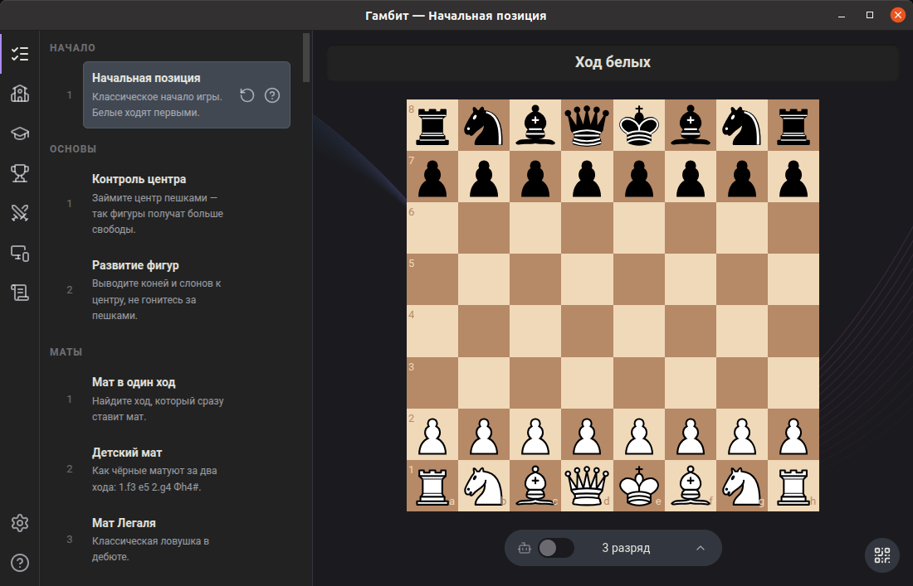

# Gambit

Учебное настольное шахматное приложение для кружка: интерактивная доска, игра против движка Stockfish, библиотека учебных позиций, группы и игроки, турниры с раундами и удалённая доска на телефоне.



## Стек

- Electron + electron-vite
- React + TypeScript
- `chess.js` (правила), `react-chessboard` (доска), Stockfish (движок-соперник)
- SQLite через встроенный `node:sqlite`
- `ws` (WebSocket для удалённой доски), `chart.js`, `qrcode`
- Vitest + Testing Library

## Структура

- `app/` — единственный пакет, всё приложение
  - `app/src/main` — main-процесс Electron: окно и жизненный цикл, база SQLite и хранилища доменов, IPC-хендлеры, локальный веб-сервер удалённой доски
  - `app/src/preload` — мост в renderer (типизированный `window.api`)
  - `app/src/renderer/src` — React-приложение и игровая логика: `engine/` (Stockfish), `chess/` (правила и представление), `components/`, `hooks/`, `help/`, `remote/`
  - `app/src/shared` — общие типы и контракты IPC между процессами
- `CONTEXT.md` — словарь домена
- `docs/adr/` — архитектурные решения
- `docs/agents/` — настройка инженерных скиллов (трекер, лейблы, доменные доки)

## Запуск

```bash
cd app
npm install
npm run dev
```

## Проверки

```bash
cd app
npm run lint
npm run typecheck
npm run test:file -- <путь>   # один файл
npm run test:changed          # изменённые тесты
npm test                      # весь прогон, для крупных правок
```

## Возможности

- Интерактивная доска: дропы фигур, подсветка ходов и шаха, превращение пешки в ферзя.
- Соперник-движок Stockfish с выбором силы.
- Библиотека учебных позиций (примеров) в базе: группы примеров, просмотр, сохранение текущей позиции, редактирование, удаление, комментарии.
- Группы и игроки: членство many-to-many, фильтр игроков по группе.
- Турниры: настройки, список турниров, раунды с лестницей и неполными парами, оверлеи результатов и график позиций игроков.
- Удалённая доска на телефоне: QR-код, зеркалирование позиции и приём ходов по WebSocket.
- Журнал событий, экспорт базы данных в файл-снимок, светлая и тёмная темы, встроенная справка.

## Чего пока нет

- Выбор фигуры при превращении — доступен только ферзь.
- Полноценная история партий и их сохранение.

## Лицензия

Gambit распространяется под GNU GPL v3 (`GPL-3.0-only`) из-за вендоренного движка Stockfish. Подробности — в `docs/adr/0005-app-license.md`.
